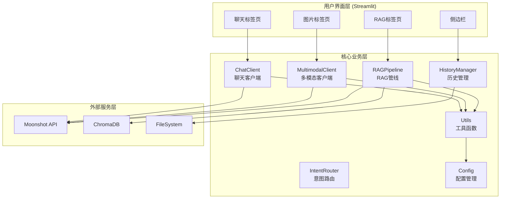
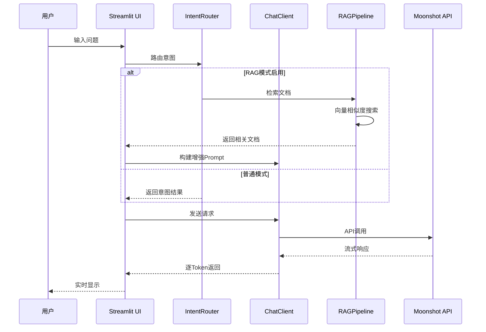
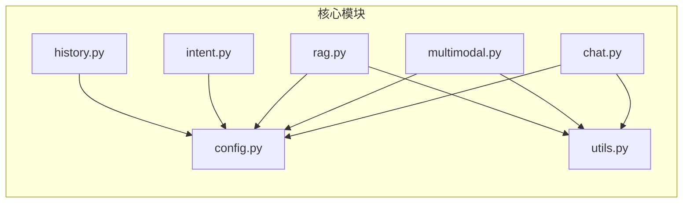
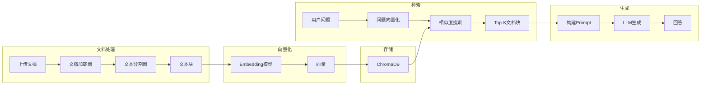
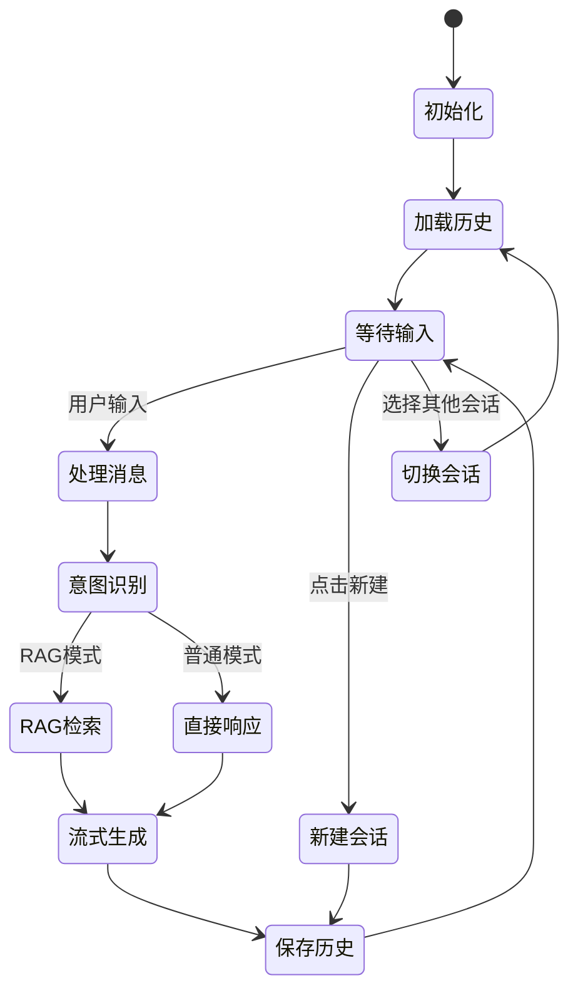
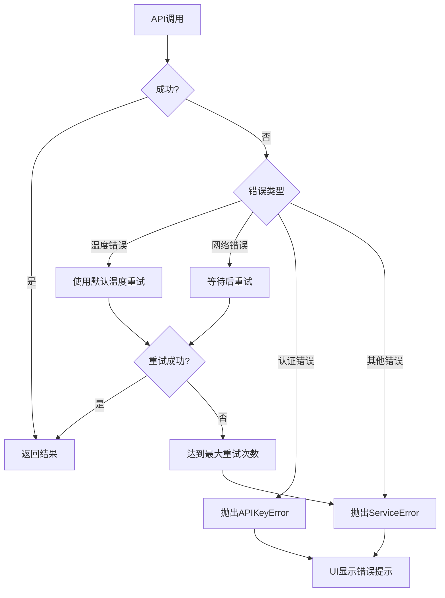

# 架构设计文档

## 整体架构



## 数据流架构



## 模块依赖关系



## RAG 管线架构



## 会话状态管理



## 错误处理流程



## 文件结构说明

```
Multimodal-Assistant/
├── app.py                    # 主入口，UI渲染
├── core/
│   ├── __init__.py          # 模块导出，统一接口
│   ├── config.py            # 配置管理，环境变量读取
│   ├── chat.py              # 聊天客户端，API调用封装
│   ├── multimodal.py        # 多模态客户端，图片处理
│   ├── rag.py               # RAG管线，文档问答
│   ├── intent.py            # 意图路由，关键词匹配
│   ├── history.py           # 历史管理，JSON持久化
│   └── utils.py             # 工具函数，重试逻辑
├── .streamlit/
│   └── config.toml          # Streamlit配置
├── history/                  # 对话历史存储
├── chromadb/                 # 向量数据库
└── docs/                     # 文档目录
```

## 关键设计决策

### 1. API 调用重试机制

采用带温度错误特殊处理的重试策略：
- 网络错误：指数退避重试
- 温度错误：自动使用默认温度 1.0 重试
- 认证错误：直接抛出，不重试

### 2. 配置集中管理

所有配置通过 `Config` 类统一管理：
- 支持环境变量覆盖
- 提供默认值
- 类型安全的访问方法

### 3. 模块化设计

每个功能独立成模块：
- 低耦合：模块间通过接口交互
- 高内聚：相关功能集中在同一模块
- 易测试：可独立测试每个模块

### 4. 流式输出

使用生成器实现流式输出：
- 实时显示 AI 回复
- 提升用户体验
- 减少等待感知时间
